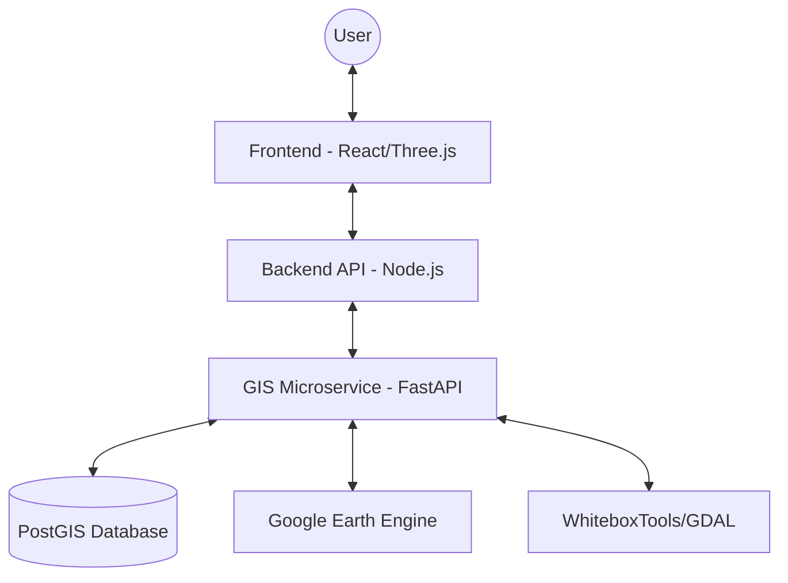

# 🛰️ Risk Prediction Engine (3D GIS)

A professional, high-performance **Disaster Risk Prediction Platform** featuring real-time 3D GIS visualization, ERA5 weather data integration, and AHP-based susceptibility mapping (Flood & Landslide).

---

## ✨ Key Features

- **🔭 3D Terrain Visualization**: Interactive 3D maps powered by Three.js and Leaflet.
- **🛰️ Satellite Data Ingestion**: Automated download and processing of ERA5 rainfall data via Google Earth Engine.
- **🧠 Intelligent Mapping**: AHP (Analytic Hierarchy Process) implementation for high-resolution flood and landslide susceptibility prediction.
- **🏗️ Decoupled Architecture**: Modular microservices for GIS processing, backend logic, and frontend visualization.
- **🌍 Full Portability**: Designed to be portable across systems with Docker and flexible data-root configuration.

---

## 🏗️ System Architecture



---

## 🚦 Quick Start

Detailed instructions can be found in the [Setup Guide](setup.md).

### 1. Database
```powershell
docker-compose up -d
```

### 2. Configure Environment
```powershell
copy .env.example .env
# Same for backend, frontend, and gis-service
```

### 3. Launch Services
- **Backend**: `npm run dev` (Port 5000)
- **GIS Service**: `uvicorn main:app` (Port 8000)
- **Frontend**: `npm run dev` (Port 3001)

---

## 📂 Project Structure

- `frontend/`: React application with 3D visualization.
- `backend/`: Node.js API container (Auth, WebSockets, DB management).
- `gis-service/`: Python FastAPI service for heavy GIS calculations.
- `database/`: Contains `schema.sql` and persistent data volumes.
- `scripts/`: System-wide utility and automation tools.

---

## 🔑 Default Credentials

| Role  | Email                  | Password   |
|-------|------------------------|------------|
| Admin | `admin@aether.local`   | `password` |
| User  | `user@aether.local`    | `password` |

---

## 🛡️ License & Integration

This system is designed for easy integration. To use it in your own system, ensure PostGIS is available and update the `DATA_ROOT` environment variable to point to your dataset directory.
