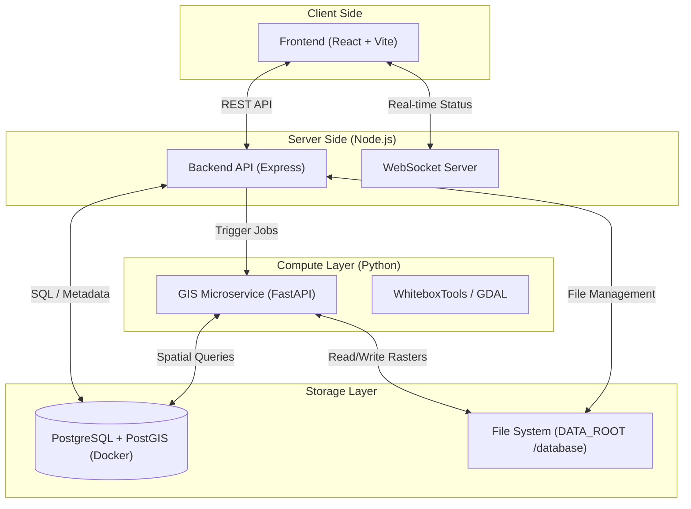

# 🏛️ System Architecture & Data Flow

This document provides a high-level overview of how the Risk Prediction Engine components interact and how data moves through the system.

## 🏗️ High-Level Architecture

---

## 🚦 Core Component Roles

### 1. Frontend (React + Vite)
- **Role**: User Interface and Interaction.
- **Key Functions**: 
  - Visualizing GIS maps (Leaflet/MapLibre).
  - Uploading DEMs/Data.
  - Selecting regions for susceptibility analysis.
  - Tracking job progress via WebSockets.

### 2. Backend (Node.js + Express)
- **Role**: System Orchestrator and API Gateway.
- **Key Functions**:
  - **Auth**: User login and role management.
  - **Job Management**: Tracks tasks (Pending, Processing, Done).
  - **Metadata**: Stores region info and dataset inventory in Postgres.
  - **Connectivity**: Forwards complex computation requests to the GIS Microservice.

### 3. GIS Microservice (Python + FastAPI)
- **Role**: Heavy-duty Geospatial Processor.
- **Key Functions**:
  - **Terrain Analysis**: Slope, TWI, Curvature extraction using WhiteboxTools.
  - **Susceptibility Mapping**: Weighted combination of spatial layers.
  - **Weather Processing**: Interpolating ERA5 rainfall data across regions.
  - **GDAL/Rasterio**: Reading/Writing multi-gigabyte `.tif` and `.shp` files.

### 4. Database (PostgreSQL + PostGIS)
- **Role**: Spatial and Relational Storage.
- **Key Functions**:
  - **Relational**: Users, Job logs, Data inventory.
  - **Spatial**: Administrative boundaries (India-wide), River networks, Soil polygons.
  - **PostGIS**: Efficiently handles coordinate systems and spatial proximity queries.

---

## 🔄 End-to-End Data Flow Example
### *Scenario: Generating a Flood Susceptibility Map*

1.  **Request**: User clicks "Generate Map" in the **Frontend**.
2.  **Job Creation**: **Backend** validates the request and creates a new entry in the `jobs` table with status `pending`.
3.  **Compute Trigger**: **Backend** calls the **GIS Microservice** via HTTP POST with the region details.
4.  **Processing**:
    - **GIS Microservice** identifies the required layers (LULC, River, Soil, DEM) from the **File System**.
    - It runs the `flood_susceptibility.py` logic.
    - It performs weighted spatial analysis.
5.  **Output**: **GIS Microservice** saves a new `.tif` result and a `.shp` vector file to the `database/output/` folder.
6.  **Status Sync**: **GIS Microservice** updates the **Database** marking the job as `done`.
7.  **Notification**: **Backend** detects the change and pushes a success message to the **Frontend** via **WebSocket**.
8.  **Visualization**: **Frontend** fetches the new result metadata and displays the map to the user.

---

## ⚙️ Shared Resources
- **`.env` files**: All services share common connection strings and paths.
- **`DATA_ROOT`**: A shared directory (default `./database`) where all services look for physical geospatial files.
- **Docker**: Encapsulates the Database to ensure the same PostGIS environment on every machine.
